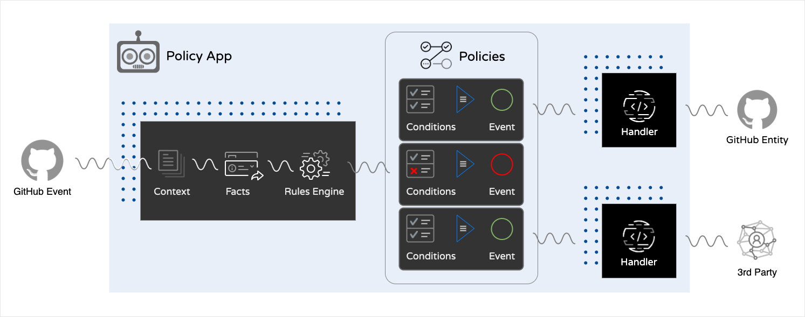
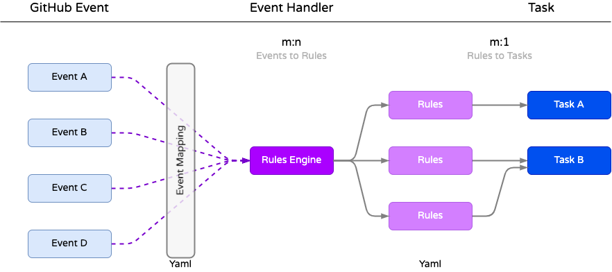
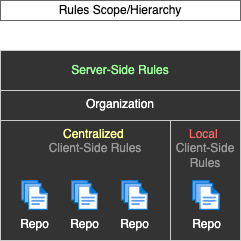

# GitHub Policy App


A GitHub App to **automatically apply policies** such as `Branch Protection`, `Team-Repo Assignment`, etc.


### Policy App Concept



---

### Policy Workflow



## Key features

- **Policies are written as Yaml formatted Rules**
  - `Server-Side` policies are located in [src/rules/active](src/rules/active)
  - `Client-Side` policies location is set in [.github/config.yml](.github/config.yml) 

- **We provide a set of default Policy Event-Handler classes** (Tasks)
  - You can find them in, [src/eventHandlers](src/eventHandlers)

- **Users can write custom Policy Event-Handler classes**
  - Create custom features for your Policies
    - Add a custom `eventHandler` class that is compliant with the [class template eventHandlerTemplate.js](src/eventHandlers/eventHandlerTemplate.js)
    - Any template compliant class, that is in the [src/eventHandlers](src/eventHandlers) folder will be "loaded" into the App at start up.

- **Policy association is user defined (based on Rules)**
  - A readable doc of the rules can be found in, the App UI.
    - Example: http://localhost:3000/policy-App/samples

---

## Developer Notes

The concept of the Policy-App is to **decouple** `conditions`=`policies`=`rules`, from business logic code, `handlers`.

### Types of Handlers

In general there are three main types of handlers

- **Generic:** Handler code is event context agnostic. Usable with any Policy.
- **Event Dependent:** Handler code relies on specific event context data.
- **Policy Dependent:** Handler code represents a specific Policy, limited flexibility.

> The `Generic` type is the most reusable type of handler

> The `Event Dependent` type might be the most common

> The `Policy Dependent` type 'hard-codes' Policy logic in the Handler. This 'breaks' the decoupling of the **Policies** and the **Handlers** but might be required to choose this in some cases.

### Event Handlers Require Specific Event Data

Event-handlers receive the context of a GitHub event and can use that data for their business logic. (*Event Dependent*)

:warning: When you write rules that invoke the Event-handler with the 'wrong' event context, some context data points might not be available and your code fails.

#### For Example

Invoking an Event-handler that works with Issue-Event context data, based on a Repo-event (create.repo), your Event-handler will not get the event data point (issue.id) it needs to function properly.

You need to consider two things:

1. Make sure the Event-handler contains some check that it received the right Event context.
2. Write Rules that only call Event-handlers with the correct Event context.

---

## Setup

### Register the App

See [installing-github-apps](https://docs.github.com/en/developers/apps/managing-github-apps/installing-github-apps)

### Configure the App (Application Host)

- Configure your App settings in [config.yml](https://github.com/github/probot-policy-app/blob/main/.github/config.yml)

  **Sample**

  ```yaml
  ---
  # Determine a Repo in your Org to provide 'client-side rules' (located under `.github/rules/`)

  # With `.`, the App will look for client-side rules in the Repo that triggered the event.
  # This makes it a 'local' client-side rule. 
  # If you provide a specific Repo to store your rules in, you create a 'centralized' client-side rule.
  # 'Client-side' rules (local or centralized) are controlled by the Repo owner.
  #  
  # Note: Any incoming event gets evaluated against 'Server-side and 'Client-side' rules!


  # Options: `Repo name` or `.` 
  rules_repo: rules-repo

  # This is a "Lazy Refresh". We only check on an incoming event, if the interval expired.
  # The reload interval for client-side rules, in minutes.
  rules_refreshInterval: 1
  ```

 - **App configuration and Policy (Rules) setup are closely related**

    Where you place your Policies determines their scope, have a look at the diagram.

    

    - **Server-Side** Rules are always located in [`src/rules/active`](src/rules/active),  
    - **Client-Side** Rules are configured in [`.github/config.yml`](.github/config.yml) 

    Note: The **Client-Side rules 'reload' interval** is configured in [`.github/config.yml`](.github/config.yml) as well

---

## Install dependencies

```bash
npm install
```

## Run the bot

```bash
npm start
```

## Docker

```sh
# 1. Build container
docker build -t probot-policy-app .

# 2. Start container
docker run -e APP_ID=<app-id> -e PRIVATE_KEY=<pem-value> probot-policy-app
```

## Contributing

If you have suggestions for how probot-policy-app could be improved, or want to report a bug, open an issue! We'd love all and any contributions.

For more, check out the [Contributing Guide](CONTRIBUTING.md).

## License

[ISC](LICENSE) © 2021 Jürgen Efeish <jefeish@github.com>

=======
APP to apply some basic policies
