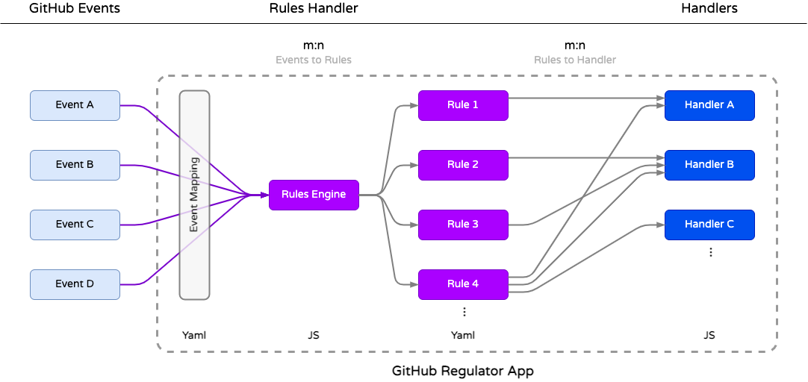

# GitHub Regulator App


A GitHub App to **apply regulations based on Rules & Handlers**.

The GitHub Regulator App is a compliance tool designed to enforce regulations using user-defined Rules and Handlers.

- Rules have the power to access the full context of an event, enabling the creation of intricate compliance conditions.
- Handlers are triggered based on conditions defined in the Rules. The app's behavior is entirely determined by the Rules, independent of the underlying code.

App behavior is fully Rules based and decoupled from application logic, making it highly adaptable and reusable.

>***Regulator***
>
>*A regulator is an entity or organization responsible for setting and enforcing rules, regulations, and standards within a specific domain or industry. The primary purpose of regulators is to ensure compliance with established guidelines*

---

### Regulator App Concept


<details><summary><h2>Advanced Docs</h2></summary>
<p>

### Processing Workflow


#### Flow Explanation

1. GitHub Events are send to the Regulator App
1. The Event-Context gets translated to Rules-Engine Facts
1. The Rules-Engine applies Rules and evaluates all conditions against the Facts
1. If all Rule conditions "pass", the Event-Context is send to a Handler (specified in the Rule)
1. The Handler can use the full context data to apply the required Policy

---

### Event to Handler Mapping

Some details on how Events, Rules and Handlers can be mapped to define and apply a regulation.



## Key features

- **Policies are written as Yaml formatted Rules**
  - The `Server-Side` policies are located in [src/rules/active](src/rules/active)
  - The `Client-Side` policies location is set in [.github/config.yml](.github/config.yml)

- **We provide a set of default Event-Handler classes** (Tasks)
  - Located in, [src/eventHandlers](src/eventHandlers)

- **Users can write custom Event-Handler classes**
  - Create custom features for your Policies
    - Add a custom `eventHandler` class that is compliant with the [class template eventHandlerTemplate.js](src/eventHandlers/eventHandlerTemplate.js)
    - Any template compliant class, that is in the [src/eventHandlers](src/eventHandlers) folder will be "loaded" into the App at start up.

- **Rules association is user defined**
  - A readable doc of the rules can be found in, the App UI.
    - Example: http://localhost:3000/policy-App/samples

>**Note:** Keep in mind that **Apps React on Events**, they **do not prevent** user actions. We can only **Dectect** & **Correct** !

---

## Developer Notes

The concept of the Regulator-App is to **decouple** `conditions`, from business logic code, `handlers`.

### Types of Handlers

In general there are three main types of handlers

- **Generic:** Handler code is event context agnostic. Usable with any Policy.
- **Event Dependent:** Handler code relies on specific event context data.
- **Policy Dependent:** Handler code represents a specific Policy, limited flexibility.

> The `Generic` type is the most reusable type of handler

> The `Event Dependent` type might be the most common

> The `Policy Dependent` type 'hard-codes' Policy logic in the Handler. This 'breaks' the decoupling of the **Policies** and the **Handlers** but might be the necessary choice for some cases.

### Event Handlers That Require Specific Event Data

Event-handlers receive the context of a GitHub event and can use that data for their business logic. (*Event Dependent*)

:warning: When you write rules that invoke the Event-handler with the 'wrong' event context, some context data points might not be available and your code fails.

#### For Example

You have an Event-handler that works with Issue-Event context data, when you invoke it with a Repo-event (eg.: create.repo), your Event-handler will not get the event data point (eg.: issue.id) it needs to function properly.

You need to consider two things:

1. Make sure the Event-handler contains some check that it received the right Event context.
2. Write Rules that only call Event-handlers with the correct Event context.

---

</p>
</details> 

## Setup

### Register the App

See [installing-github-apps](https://docs.github.com/en/developers/apps/managing-github-apps/installing-github-apps)

### Configure the App (Application Host)

- Configure your App settings in [.github/config.yml](https://github.com/github/probot-policy-app/blob/main/.github/config.yml)

  **Sample**

  ```yaml
  ---
  # Determine a Repo in your Org to provide 'client-side rules' (located under `.github/rules/`)

  # With `.`, the App will look for client-side rules in the Repo that triggered the event.
  # This makes it a 'local' client-side rule. 
  # If you provide a specific Repo to store your rules in, you create a 'centralized' client-side rule.
  # 'Client-side' rules (local or centralized) are controlled by the Repo owner.
  #  
  # Note: Any incoming event gets evaluated against 'Server-side and 'Client-side' rules!


  # Options: `Repo name` or `.` 
  rules_repo: rules-repo

  # This is a "Lazy Refresh". We only check on an incoming event, if the interval expired.
  # The reload interval for client-side rules, in minutes.
  rules_refreshInterval: 1
  ```

 - **There are 3 types of Rules locations**

    The location of your Rules folder determines the scope and control of the Rules.

    |||
    |---|---|
    |**Server-Side**| Rules are always located in the App folder [`src/rules/active`](src/rules/active),  
    |**Centralized Client-Side**| Rules are configured in a Rules Repository in [`.github/config.yml`](.github/config.yml) 
    |**Local Client-Side**| Rules are configured in the Repo that triggered the event in [`.github/config.yml`](.github/config.yml) 


 >Note: The **Server-Side** Rules are controlled be the App Owner and will be loaded & evaluated regardless of `config.yml` **rules_repo** settings.

---

## Install dependencies

```bash
npm install
```

## Run the App

```bash
npm start
```

## Docker

```sh
# 1. Build container
docker build -t probot-policy-app .

# 2. Start container
docker run -e APP_ID=<app-id> -e PRIVATE_KEY=<pem-value> probot-policy-app
```


## Contributing

If you have suggestions for how probot-policy-app could be improved, or want to report a bug, open an issue! We'd love all and any contributions.

For more, check out the [Contributing Guide](CONTRIBUTING.md).

## Apendix

- [**GitHub REST API Docs**](https://docs.github.com/en/rest)

  - [**GitHub REST API (Octokit) Docs**](https://octokit.github.io/rest.js/v18)

- [**GitHub GraphQL API Docs**](https://docs.github.com/en/graphql)

  - [**GitHub GraphQL API Samples**](https://github.com/octokit/graphql.js)

- [**GitHub Webhook-Events**](https://docs.github.com/en/developers/webhooks-and-events/webhooks/webhook-events-and-payloads)

- [**JSON Rules Engine**](https://github.com/CacheControl/json-rules-engine)

## License

[ISC](LICENSE) © 2021 Jürgen Efeish <jefeish@github.com>

---
---
