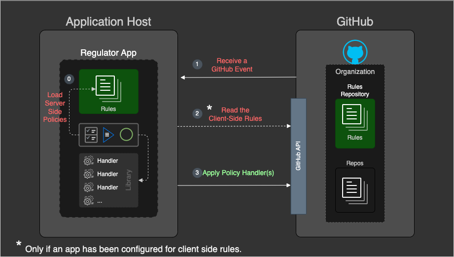

# Probot Policy App

A GitHub App to **`automatically apply policies`** such as `Branch Protection`, `Team-Repo Assignment`, etc.
<br><br>


<!--  -->

## Key features

- **Policies are written as Yaml formatted Rules**

- **We provide a set of default Policy Event-Handler classes** (Tasks)
  - You can find them in, [src/eventHandlers](src/eventHandlers)

- **Users can write custom Policy Event-Handler classes**
  - Create custom features for your Policies
    - Add a custom `eventHandler` class that is compliant with the [class template eventHandlerTemplate.js](src/eventHandlers/eventHandlerTemplate.js)
    - Any template compliant class, that is in the [src/eventHandlers](src/eventHandlers) folder will be "loaded" into the App at start up.

- **Policy association is user defined (based on Rules)**
  - A readable doc of the rules can be found in, [rules_doc.md](https://github.com/github/probot-policy-app/blob/main/rules-doc.md)

## Setup

### Register the App

See [installing-github-apps](https://docs.github.com/en/developers/apps/managing-github-apps/installing-github-apps)

### Configure the App (Application Host)

- Configure your App settings in [config.yml](https://github.com/github/probot-policy-app/blob/main/.github/config.yml)

  **Sample**

  ```yaml
  ---
  # Determine a Repo in your Org to provide 'client-side rules' (located under `.github/rules/`)

  # With `.`, the App will look for client-side rules in the Repo that triggered the event.
  # This makes it a 'local' client-side rule. 
  # If you provide a specific Repo to store your rules in, you create a 'centralized' client-side rule.
  # 'Client-side' rules (local or centralized) are controlled by the Repo owner.
  #  
  # Note: Any incoming event gets evaluated against 'Server-side and 'Client-side' rules!


  # Options: `Repo name` or `.` 
  rules_repo: rules-repo

  # This is a "Lazy Refresh". We only check on an incoming event, if the interval expired.
  # The reload interval for client-side rules, in minutes.
  rules_refreshInterval: 1
  ```

 - **App configuration and Policy (Rules) setup are closely related**

    Where you place your Policies determines their scope, have a look at the diagram.

    

---

## Install dependencies

```bash
npm install
```

## Run the bot

```bash
npm start
```

## Docker

```sh
# 1. Build container
docker build -t probot-policy-app .

# 2. Start container
docker run -e APP_ID=<app-id> -e PRIVATE_KEY=<pem-value> probot-policy-app
```

## Contributing

If you have suggestions for how probot-policy-app could be improved, or want to report a bug, open an issue! We'd love all and any contributions.

For more, check out the [Contributing Guide](CONTRIBUTING.md).

## License

[ISC](LICENSE) © 2021 Jürgen Efeish <jefeish@github.com>

=======
APP to apply some basic policies
