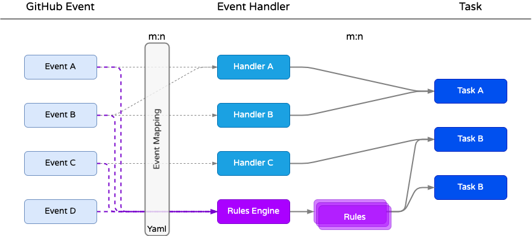
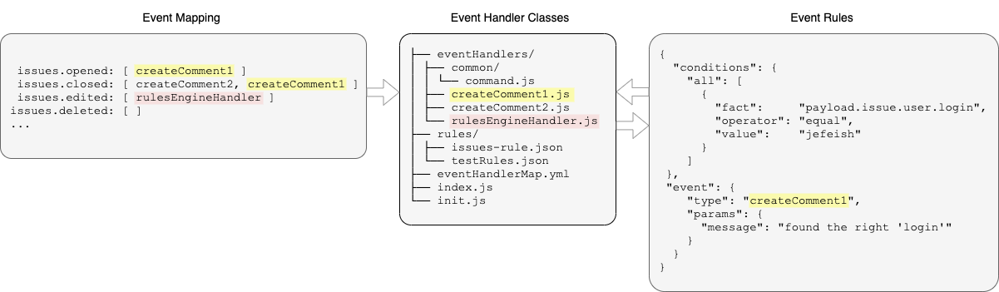

# EventPattern-RulesEngine App Concept


This App provides **Event-Handler and Rules Engine** support, on top of the Probot framework.

> Note: For very simple Probot Apps, this might not provide much of an advantage. It becomes useful with larger, more complex Apps, that require behavior flexibility.

## Index

- [Introduction](#Introduction)
- [Concept](#Concept)
  - [Event-Handler-Sample](#Event-Handler-Sample)
  - [Rules-Engine-Sample](#Rules-Engine-Sample)
- [Tutorials](#Tutorials)
- [Development](#Development)
- [Configuration](#Configuration)
  - [Rules-Location](#Rules-Location)
  - [Rules-Engine-Operators](#Rules-Engine-Operators)
- [References](#References)
  - [GitHub-Events](GitHub-Events)

---

## Introduction

The intention of this App is to **decouple App behavior from code** (externalize it) and make any code/module that uses the GitHub API as _atomic_ as possible.

Two simple concepts,

- Use **Event Mapping** for *GitHub Events* to *Event Handlers*, via a yaml file
- Use **Rules Engines** to evaluate *GitHub event context* and create **rule based routing** to handler classes

This eliminates complex **condition based workflows** in the code and, if the Handlers are **atomic** enough, better **code reusability**.

With an **externalized event workflow** we can control the behavior of the GitHub App without code changes or app restarts.

[Index](#Index)

---

## Concept



---

> Implementation details (omitting common code)



---

### Event-Handler-Sample

The mapping of the _GitHub event_ to the _eventHandler class_ is done during app initialization.

Some sample mappings

```yaml
issues.opened: [createComment1]
issues.closed: [createComment2, createComment1]
issues.edited: [rulesEngineHandler]
issues.deleted: []
...
```

- createComment1
- createComment2
- rulesEngineHandler

...these are some sample classes in the **eventHandlers** folder.

```bash
src/
├── eventHandlers/
│   ├── common/
│   │   └── command.js
│   ├── createComment1.js
│   ├── createComment2.js
│   └── rulesEngineHandler.js
├── rules/
│   ├── issues-rule.json
│   └── testRules.json
├── eventHandlerMap.yml
├── index.js
└── init.js
```

> Any class that represents an _Event Handler_ **must** extend the `Command` class

```node
/**
 * Trying to implement the 'command pattern' in NodeJS
 * A poor man's interface
 */
class Command {
  // eslint-disable-next-line no-useless-constructor
  constructor() {
    if (!this.execute) {
      throw new Error("This is not a valid 'EventHandler' class. The class must implement an 'execute()' method!");
    }
  }
}

module.exports = Command
```

---

### Rules-Engine-Sample

In this implementation the _Rules-Engine_ is wrapped by it's own Handler,
which in turn uses other Handler classes as execution targets. **GitHub event context** data is used as **facts** for rule conditions.

> Note: for the rules engine we use the ['json-rules-engine'](https://github.com/CacheControl/json-rules-engine) implementation.

> Note: the Rules Engine is currently part of this Repo (`src/rules-engine-module/`), local copy of the OSS. This was done to apply some additional features that are not part of the OSS yet, specifically `includes` and `regex` operators. This should be adjusted to use the NPM packages as soon as possible.  

Sample ***GitHub event context***

```json
{
  "event": "issues",
  "payload": {
    "action": "opened",
    "issue": {
      "user": {
        "login": "jefeish",
...
```

Sample ***rule condition***

> JSON Format

```json
{
  "conditions": {
    "all": [
      {
        "fact": "payload.issue.user.login",
        "operator": "equal",
        "value": "jefeish"
      }
    ]
  },
  "event": {
    "type": "createComment1",
    "params": {
      "message": "found the right 'login'"
    }
  }
}
```

> Yaml Format

```yaml
---
conditions:
  all:
  - fact: payload.issue.user.login
    operator: equal
    value: jefeish
event:
  type: createComment1
  params:
    message: found the right 'login'
```

> Note: the `type` name must match a `.js` file name in the `eventHandlers/` folder!

[Index](#Index)

---

## Development

### Run the development sample

```bash
> npm install
```

```bash
> npm run dev
```

[Index](#Index)

---

## Configuration

### Some important configuration files

| | |
|---|---|
| Event-Handler-Mapping | The mapping file that describes the event mapping to Handlers. A sample can be found [here](./src/eventHandlerMap.yml) |
| Rule-Definitions | The Rules JSON/Yaml files are part of your App or Repo. A sample can be found [here](./src/rules/issues-rule-0.json) |

**Note:** the App always loads rules from two locations (App and Repo), see [Rules-Location](#Rules-Location) for details.

---

### Rules-Location

The *Rules* are loaded from two locations.

1. **App Rules** (Server Side)
   - located in `/src/rules/`. They are loaded at App initialization, to recognized rules changes, the App needs to be restarted.

1. **Repository Rules** (Client Side)
   - located in `./github/rules/`. They are loaded at rule event execution & a refersh interval therefore within that interval representing the latest rule-set.  

---

### Rules-Engine-Operators

- equal
- notEqual
- in
- notIn
- contains
- doesNotContain
- lessThan
- lessThanInclusive
- greaterThan
- greaterThanInclusive

#### Custom Operators

- `includes` - String has substring

  Rules Sample

  > Condition: String contains substring 'bug' (at least once)

  ``` yaml
  - fact: payload.issue.title
    operator: includes
    value: bug
  ```

---

- `doesNotInclude` - String does not have substring

  Rules Sample

  > Condition: String does not contain substring 'bug' (at least once)

  ``` yaml
  - fact: payload.issue.title
    operator: doesNotInclude
    value: bug
  ```

---

- `regex` - Regular expression evaluation

  Rules Sample

  > Condition: String starts with '.bug'

  ``` yaml
  - fact: payload.issue.title
    operator: regex
    value: ^\.bug
  ```

---

- `dateLessThan` - Timestamps is `younger` or `equal` than current date

  Rules Sample

  > Condition: Current date is 3 days younger than fact date

  ``` yaml
  - fact: payload.repository.created_at
    operator: dateLessThan
    value: 3
  ```

---

- `dateGreaterThan` - Timestamps is `older` or `equal` than current date

  Rules Sample

  > Condition: Current date is 3 days older than fact date

  ``` yaml
  - fact: payload.repository.created_at
    operator: dateGreaterThan
    value: 3
  ```

[Index](#Index)

---

## References

Some references to make working with this 'framework' easier.

### GitHub-Events

For information on GitHub events and Payloads check [here](https://developer.github.com/webhooks/event-payloads/). This reference helps to provide the `eventHandler.yml` entries.

---

### GitHub Octokit/rest.js

For API information to use within your `eventHandler` classes check [Octokit](https://octokit.github.io/rest.js)
  
[Index](#Index)

---
